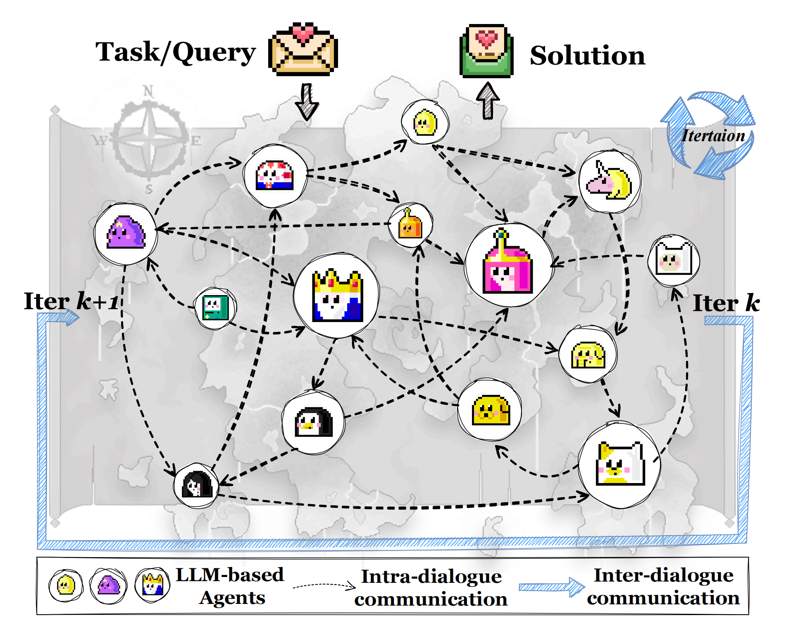

# AgentPrune

## Overview



AgentPrune is an economical, simple, and robust multi-agent communication framework, which can seamlessly integrate into mainstream multi-agent systems and prunes redundant or even malicious communication messages.

We provide the code of our paper. The algorithm implementation code is in `AgentPrune` folder, and the experimental code is in `experiments` folder.

## Quick Start

### Install packages

```bash
conda create -n agentprune python=3.10
conda activate agentprune
pip install -r requirements.txt
```

### Add API keys in `template.env` and change its name to `.env`

```python
BASE_URL = "" # the BASE_URL of OpenAI LLM backend
API_KEY = "" # for OpenAI LLM backend
```

### Download Datasets
Download MMLU, HumanEval and GSM8K datasets from MMLU, HumanEval and GSM8K. And put them in different folders.

### Run AgentPrune on MMLU by running the following scripts

```bash
python experiments/run_mmlu.py --agent_nums 1 --mode DirectAnswer --decision_method FinalMajorVote --agent_names AdverarialAgent --batch_size 4
python experiments/run_mmlu.py --agent_nums 6 --mode FakeChain --decision_method FinalMajorVote --agent_names AdverarialAgent --batch_size 4
python experiments/run_mmlu.py --agent_nums 6 --mode FakeRandom --decision_method FinalMajorVote --agent_names AdverarialAgent --batch_size 4
python experiments/run_mmlu.py --agent_nums 6 --mode FakeAGFull --batch_size 4 --num_iterations 10 --imp_per_iterations 5 --pruning_rate 0.25 --num_rounds 1 --optimized_spatial --optimized_temporal
```

The above code verifies the experimental results of the `mmlu` dataset under different topologies.

We also provide experimental code for other datasets and topologies.You can refer to `experiments/run_humaneval.py` and `experiments/run_gsm8k.py`.

## Acknowledgement

This code refers to [GPTSwarm](https://github.com/metauto-ai/GPTSwarm).
