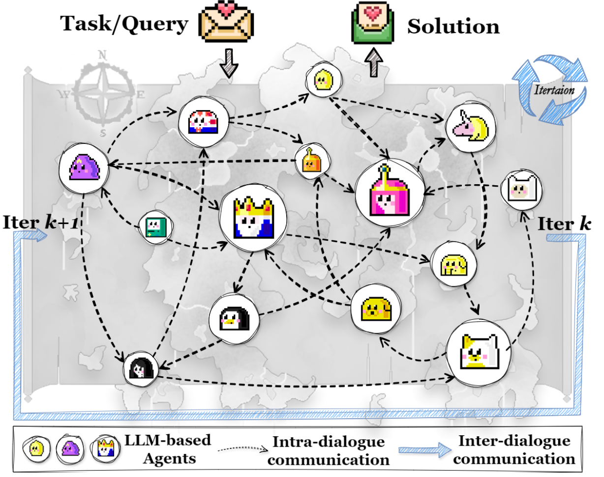
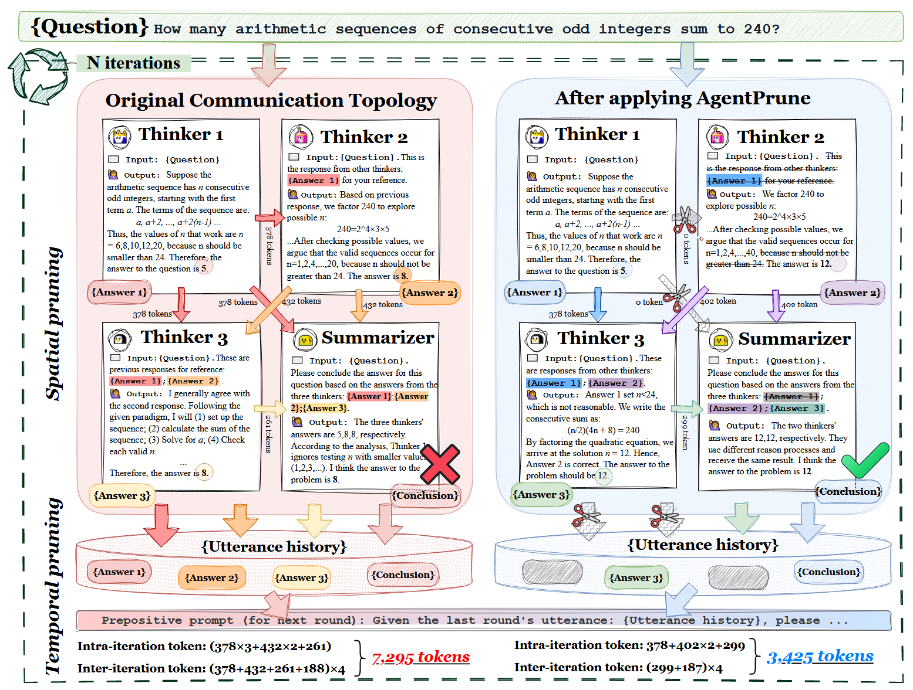

# ✂️ AgentPrune




## 📰 Paper

- 🎉 Updates (2025-01) AgentPrune is accepted by [ICLR](https://openreview.net/forum?id=LkzuPorQ5L)
- 🚩 Updates (2024-10) The paper is available at arXiv [PDF](https://arxiv.org/abs/2410.02506).

## 👋🏻 Method Overview



AgentPrune is an economical, simple, and robust multi-agent communication framework. It can prune redundant or even malicious communication messages to improve the reasoning accuracy and efficiency of multi-agent systems.

We provide the code of our paper. The algorithm implementation code is in `AgentPrune` folder, and the experimental code is in `experiments` folder.

## 🚀 Quick Start

### 📦 Install packages

```bash
conda create -n agentprune python=3.10
conda activate agentprune
pip install -r requirements.txt
```

### 📊 Datasets

Please download the `MMLU`, `HumanEval`, and `GSM8K` datasets and place them in the `dataset` folder. The file structure should be organized as follows:

```
dataset
└── mmlu
    └── data
└── humaneval
    └── humaneval-py.jsonl
└── gsm8k
    └── gsm8k.jsonl
...
```

### 🔑 Add API keys in `template.env` and change its name to `.env`

```python
BASE_URL = "" # the BASE_URL of OpenAI LLM backend
API_KEY = "" # for OpenAI LLM backend
```

### ▶️ Run AgentPrune on MMLU by running the following scripts

```bash
python experiments/run_mmlu.py --agent_nums 1 --mode DirectAnswer --decision_method FinalMajorVote --agent_names AdverarialAgent --batch_size 4
python experiments/run_mmlu.py --agent_nums 6 --mode FakeChain --decision_method FinalMajorVote --agent_names AdverarialAgent --batch_size 4
python experiments/run_mmlu.py --agent_nums 6 --mode FakeRandom --decision_method FinalMajorVote --agent_names AdverarialAgent --batch_size 4
python experiments/run_mmlu.py --agent_nums 6 --mode FakeAGFull --batch_size 4 --num_iterations 10 --imp_per_iterations 5 --pruning_rate 0.25 --num_rounds 1 --optimized_spatial --optimized_temporal
```

The above code verifies the experimental results of the `mmlu` dataset under different topologies.

We also provide experimental code for other datasets and topologies.You can refer to `experiments/run_humaneval.py` and `experiments/run_gsm8k.py`.

### 🔗 Integrate into other multi-agent systems frameworks

We demonstrate the integration of AgentPrune with the widely-used `AutoGen` and `GPTSwarm` frameworks. Although the integration is not based on their original codebase, the underlying logic remains consistent with the frameworks' core principles. Specifically, the integration with `GPTSwarm` aligns with its edge-optimized mode, while the integration with `AutoGen` corresponds to its RoundRobinGroupChat mode.

```bash
python experiments_autogen/run_humaneval.py --optimized_spatial --optimized_temporal
python experiments_autogen/run_gsm8k.py --optimized_spatial --optimized_temporal --no_spatial
python experiments/run_mmlu.py --mode FullConnected --batch_size 4 --agent_nums 5 --num_iterations 200 --imp_per_iterations 200 --pruning_rate 0.5 --num_rounds 1 --optimized_spatial
```
## 📚 Citation

If you find this repo useful, please consider citing our paper as follows:
```bibtex
@inproceedings{
    zhang2025cut,
    title={Cut the Crap: An Economical Communication Pipeline for {LLM}-based Multi-Agent Systems},
    author={Guibin Zhang and Yanwei Yue and Zhixun Li and Sukwon Yun and Guancheng Wan and Kun Wang and Dawei Cheng and Jeffrey Xu Yu and Tianlong Chen},
    booktitle={The Thirteenth International Conference on Learning Representations},
    year={2025},
    url={https://openreview.net/forum?id=LkzuPorQ5L}
}
```

## 🙏 Acknowledgement

This code refers to [GPTSwarm](https://github.com/metauto-ai/GPTSwarm).
